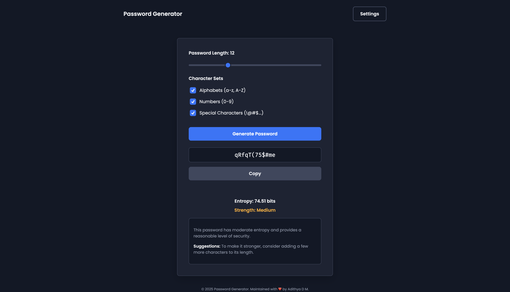

# Aegis Password Generator (Chrome Extension)

A modern, secure, and feature-rich Chrome extension built with vanilla HTML, CSS, and JavaScript. This extension provides users with cryptographically strong passwords and real-time feedback on their security strength, all wrapped in a clean, compact, and responsive dark-themed popup UI.

[](https://chrome.google.com/webstore)
[](https://opensource.org/licenses/MIT)



## About The Project

This project evolved from a standalone site into a robust, security-focused Chrome extension. The goal was to create a tool that is always just a click away, providing strong passwords while educating users on security concepts like entropy. It prioritize performance and security, using modern web standards without external frameworks.

## Features

-   🔐 **Cryptographically Secure:** Uses the `window.crypto` API for generating truly unpredictable characters, ensuring professional-grade security.
-   ⚡ **Real-Time Generation:** Passwords update instantly as you adjust the length slider or toggle character sets.
-   🎛️ **Customizable Options:** Easily control length and include/exclude alphabets, numbers, and symbols.
-   ⚙️ **Advanced Settings:** Fine-tuned control via the settings modal:
    -   Exclude similar-looking characters (e.g., `i`, `l`, `1`, `O`, `0`).
    -   Enforce minimum character type requirements (e.g., at least 1 number).
-   📊 **Strength Analysis:** Calculates real-time entropy in bits with actionable feedback (Weak, Medium, Strong).
-   ✨ **Secure Shuffle:** Uses the Fisher-Yates algorithm to ensure character order is completely unbiased.
-   📋 **One-Click Copy:** Fast copying with clear checkmark feedback.
-   💾 **Persistent Chrome Storage:** Uses `chrome.storage.local` to remember your settings across browser sessions.
-   🎨 **Compact Dark UI:** Optimized for a scroll-free experience within the 400px Chrome popup window.

## Tech Stack

Built from the ground up with a focus on modern best practices and zero dependencies.

-   **Manifest V3:** Configured for the latest Chrome extension standards.
-   **HTML5/CSS3:** Semantic structure and custom-styled with Variables, Flexbox, and Grid for a premium dark theme.
-   **Vanilla JavaScript (ES6+):** Pure logic using modern APIs (Web Crypto, Clipboard, Storage).

## How To Install (Developer Mode)

Since this is currently an unpacked project, follow these steps to use it:

1.  **Clone/Download the repository:**
    ```bash
    git clone https://github.com/your-username/your-repository-name.git
    ```
2.  **Open Chrome Extensions Page:**
    -   Type `chrome://extensions/` in your address bar.
    -   Alternatively, go to **Settings > Extensions**.
3.  **Enable Developer Mode:**
    -   Toggle the switch in the top-right corner.
4.  **Load Unpacked Extension:**
    -   Click the **"Load unpacked"** button.
    -   Select the project folder containing `manifest.json`.
5.  **Pin to Toolbar:**
    -   Click the "Extensions" (puzzle piece) icon in your toolbar and pin **Secure Password Generator**.

## License

This project is licensed under the MIT License - see the [LICENSE.md](LICENSE.md) file for details.